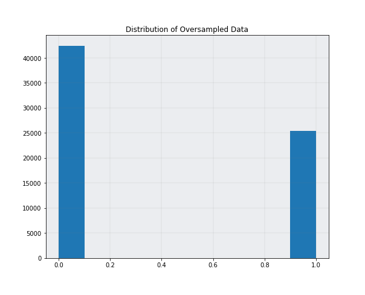

# Machine Learning Engineer Nanodegree
## Capstone Project
Mani Singh  
December 31st, 2050

## I. Definition

### Project Overview
In the marketing industry, there's an old saying that marketers waste half of their money. While this may be hyperbole, a study conducted by Rakuten Marketing reveals that marketers waste on average 26% of their budgets on ineffective channels and strategies.[^1] However, with advancements in artificial intelligence, marketers may be able to create better customer segments and accurately predict whether or not those exposed to their marketing campaign will become a customer.
[^1]: This is the first footnote.

In this project, I created a machine learning model that can predict whether or not a recipient of a marketing campaign will become a customer. I also used machine learning techniques to identify different customer segments along with the variables that best describe the segments. The models are trained using data from a mail-order sales company in Germany provided by Bertelsmann/Arvato and is accessed through Udacity.

### Problem Statement
The project can be split into two main parts: unsupervised learning and supervised learning. However, before working on each part, the following tasks must be performed:

1. Download the general population, customer, training, and test data from Udacity.
2. Clean the data so that it can be used for analysis and training machine learning models.
3. Perform data analysis to increase familiarity with the data and discover interesting trends

After these tasks are completed, the unsupervised learning portion of the project can be completed, which includes the following steps:

1. Reduce the dimensionality of the customer data and general population data.
2. Use the k-means clustering machine learning algorithm to create segments in the customer data and the general population data.
3. Create a visualization that shows the most influential principal components for every cluster and then relate those principal components back to the features in order to learn what features make up each cluster.

The last part of the project will be training a machine learning model that can accurately predict whether or not a recipient of a marketing campaign will become a customer. The tasks for this part include:

1. Balancing the dataset so that the model has enough positive observations to learn from.
2. Use cross validation to compare the generalized performance of many different models.
3. Perform hyperparameter tuning and feature selection for the best models

### Metrics
There will be three metrics used to evaluate the supervised learning model: accuracy, recall, and precision.

Accuracy is a common metric used for binary classification problems and it measures the percentage of observations that were correctly classified. 

$$accuracy = \frac{\text{true positives} + \text{true negatives}}{\text{number of observations}}$$

Recall is a metric that measures percentage of actual positives that were classified correctly. In this case, it would represent the percentage of recipients of the marketing campaigns who became customers that were classified correctly by the supervised model. In order to achieve a high recall, the goal is to create a model that accurately predicts potential customers therfore reducing the number of false negatives. From a business standpoint, false negatives are not ideal because that means that the model did not identify people who would have likely became customers after being exposed to an marketing campaign.

$$recall = \frac{\text{true positives}}{\text{true positives} + \text{false negatives}}$$

Precision is a metric that measures the percentage of observations classified as positive by the model that were actually positive. A  high precision would mean minimizing the number of false positives. For this problem, that means minimizing the number of people that are  incorrectly classified as becoming customers.

$$precision = \frac{\text{true positives}}{\text{true positives} + \text{false positives}}$$

## II. Analysis

### Data Exploration
The data provided by Bertelsmann/Arvato consists for four different datasets that each contain over 300 features. The largest of the datasets is the general population data (891,211 observations). The next largest dataset is the customer data (191,652 observations). The training data and test data both contain about 43,000 observations. 

The columns of every dataset are categorical with most of the categorical columns already encoded to a numerical scale. The data also contains many null values, like the 'CAMEO_DEUG_2015' that is missing 98979 observations. There were also three columns whose values were over 95% null. In addition to null values, there are a few columns that still contain strings instead of numbers so they will need to be encoded. Also, in the 'CAMEO_DEUG_2015' and 'CAMEO_INTL_2015' columns, there are occurences of the value 'X' and 'XX'. These were not mentioned in the dataset descriptions and it is not known whether or not they are missing. Another issue that exists specifically in the training data is the large imbalance between the positive responses and the negative responses. Only 1.24% of the responses are positive. This will make it difficult for machine learning models to learn how to classify positive instances which will lead to lower recall. 

### Exploratory Visualization
The plot below shows a histogram of the response variable. This is helpful for visualizing any class imbalance that may be present in the response variable.

**Fig. 1** A plot showing how the responses of the recipients of a marketing campaign are distributed. 0 indicates that the person who was exposed to the marketing campaign did not become a customer while 1 indicates that the person did become a customer. The bar plot shows that there is a large imbalance between the positive and negative class. However, this makes sense because the average conversion rate for mail order campaigns is generally 1/2 to 2 percent.[^2]
[^2]: This is the second footnote.

**Fig. 2** The following plot shows the response rate for different age groups. This information is helpful for analyzing features that are potentially predictive or correlated with the response variable. For example, if the graph showed that the younger age groups have higher response rates, it can be concluded that age groups would be a good variable to include in the models since it has a relationship with the response variable. 

When analyzing the relationship between age groups and the response variable, it is important that the response rate is used instead of the total number of responses for each age group. As evidenced in the histogram below for the age groups, all the age groups are not evenly distributed. 

For example, -1, which indicates that the age group is missing, could have a higher number of positive responses than age group 0 due to the fact that it there are more people who do not have an indicated age group. However, using a percentage mitigates this effect.

### Algorithms and Techniques
For the unsupervised learning portion of the project, the goal is to create effective customer segments. In order to achieve this, k-means clustering will be used to group the customer data into different clusters that are each defined by a set of features. Like many machine learning algorithms, k-means is most effective when it is trained on a lot of data. Additionally, it is good to reduce the dimensionality of the data because as the number of features increases, the noise in the dataset increases which makes it harder to create good clusters. A good cluster is one where all the point within the cluster are close to each other but the cluster itself is not close to any other cluster. While the k-means clustering algorithm takes as input many hyperparameters, the one that will be tuned and optimized will be k, the number of clusters. 

For the supervised learning portion of the project, the problem at hand is a binary classfication problem which means many different algorithms can be used to predict whether or not a marketing campaign recipient will become a customer. These algorithms include logistic regression, random forest, gradient boosting machines(GBM), extreme gradient boosting machines(XGBoost), naive bayes, and support vector machines(SVM). Each of these algorithms use a different set of hyperparameters that can be tuned to boost model performance. 

In order to train the supervised models mentioned above, the training data will be given as input to the models and they will all be trained with the default values for the hyperparameters. The best performing models will then be selected and hyperparameter tuning can be used to improve their performance.

### Benchmark
The benchmark used for supervised learning portion of the project is the logistic regression model. The logistic regression model is simple so it provides a measurable baseline that can be used in comparison with more powerful algorithms like XGBoost. In the end, the final model should outperform the benchmark model. Some of the hyperparameters and their values are shown below.

- penalty - "l2"
- tol - 1e-4
- class_weight - "balanced"
- solver - "saga"
- max_iter - 5000

After training the logistic regression model on the training data, the evaluation metrics were calculated on the training data and are shown below.

- accuracy - 69.28%
- recall - 60.34%
- precision - 2.41%

From the evaluation metrics, we see that the baseline model performed pretty poorly. It is evident from the low precision that the model is having trouble identifying false positives so this will need to be addressed when creating the final model. 

## III. Methodology
_(approx. 3-5 pages)_

### Data Preprocessing
The preprocessing and data cleaning steps done in the "data_cleaning" notebook consist of the following steps:

1. Replacing missing data with the value -1. This essentially places missing data in it's own category and is a favorable method over data imputation since it does not introduce bias into the data.
2. Encoding the "X" and "XX" values found in the "CAMEO_DEUG_2015" and "CAMEO_INTL_2015" columns. The machine learning models used in this project do not take in strings as input so "X" and "XX" were encoded with 10 and 56 respectively.
3. Removing columns whose values are more than 95% null. Columns that have too many null values make are troublesome because the rows with null values cannot be removed since that would mean deleting 95% of the data. On the other hand, if we decide to impute the null values, that would introduce too much bias into the data.
4. One-hot encoding the "CUSTOMER_GROUP" and "PRODUCT_GROUP" columns. These are categorical columns where the labels are not ordinal so one-hot encoding is used to present the categorical variables as nominal to the machine learning models. This will ensure the machine learning model does not assume some ordinal relationship between the labels in each column respectively. 

After these preprocessing steps were complete, the cleaned data was exported to csv files and then used for modeling. 

### Implementation
The implementation process can be split into two stages:

1. The unsupervised clustering stage 
2. The supervised classifier stage

In the first stage, a clustering model was trained on the customer data. However, before training the k-means clustering model, it was necessary to reduce the dimensionality of the data. This is because high dimensionality data has a lot of noise which makes it harder for the model to create good clusters. So to reduce the number of columns, principal component analysis (PCA) was used. PCA provides a tradeoff between variance and dimensionality. The goal is preserve as much variance as possible while also making a significant reduction in the dimensionality. An elbow graph is often used to visualize the point at which the reduction of variance is worth the decrease in dimensionality. The elbow graph for the PCA model fitted to the customer data is shown below.

From the graph, we can see that the cumulative explained variance increases at a fast rate until the number of principal components is equal to 2. After this, the cumulative explained variance increases steadily until it converges at 1. In this case, four will be the optimal number of principal components since the change in cumulative explained variance after 4 is very small. Then we fit a PCA model with four principal components to the customer data. The result is a dataframe of size 191,652 by 4 which is a big improvement over the original dataframe of size 191,652 by 364. 

After performing dimensionality reduction, the reduced dataframe can now be used as input in the k-means clustering model. However, it is first necessary to find the optimal number of clusters. Similar to finding the optimal number of principal of components, an elbow graph can be used to find the optimal value of k. Instead of explained variance, the Silhouette Score is used. The Silhouette Score is calculated for each instance and is defined by the following formula:

$$\text{Silhouette Coefficient} = \frac{x-y}{max(x,y)}$$

where, y is the mean distance to the other instances in the same cluster and x is the mean distance to the instances in the next closest cluster. The coefficient is any value in the range $[-1, 1]$. A value close to 1 means that the instance is close to its assigned cluster therefore, it is in the correct cluster. A value close to -1 means that the instance is far from its assigned cluster therefore, it is assigned to the wrong cluster. The following is a an elbow graph for the Silhouette Score as a function of the number of clusters.

 Although the elbow in the graph above is not as well defined as the variance plot, it is still clear that four clusters is optimal. After four clusters, there is a sharp decrease in the mean Silhouette Score and then the mean Silhouette Score continues to decrease steadily. 

 After finding the optimal number of clusters, all the components needed to train the final k-means clustering model have been found. Due to the large size of the data, the MiniBatchKMeans algorithm from the Scikit-learn library will be used instead of the traditional KMeans algorithm. The purpose of the MiniBatchKMeans algorithm is to speed up the computation time by training on a random subset of the data during each iteration. The "n_clusters" hyperparameter for the MiniBatchKMeans algorithm will be set to four and it will be trained on the dimensionality reduced data. 

 Because the data given to the MiniBatchKMeans algorithm has four dimensions, the clusters cannot be visualized on a traditional graph since we can only visualize in three dimensions. However, a heatmap can be used to visualize the clusters. The "cluster_centers_" attribute of the fitted models stores the coordinates of each cluster with respect to the four principal components. This attribute can then be used to create a heatmap where the location of a cluster relative to a principal component can be described numerically. The heatmap for the MiniBatchKMeans model is shown below.

In the second stage, before training any models, it was necessary to fix the class imbalance of the training data. As mentioned previously, only 1.24% of observations in the training set were positive. This makes it very difficult for machine learning algorithms to learn how to classify positive observations. This idea is evidenced by the poor performance of the benchmark model, which was trained on the original, imbalanced data. There are two methods primarily used to remedy class imbalance: undersampling and oversampling. Undersampling involves sampling only a subset of the majority class but this leads to a loss of data. Oversampling involves repeatedly sampling the minority class but sampling the same observations many times introduces bias when training the model. Observations that are identical have no variance which makes it harder for a machine learning algorithm to learn. The solution to this problem was using the SMOTE algorithm. The SMOTE algorithm is used to oversample the minority class but it generates these samples using the k-nearest neighbors algorithm. Therefore, the samples it generates are not identical which means minimum bias is introduced to the training data. The SMOTE algorithm takes as input the feature matrix and the labels. The "fit_resample" method of the SMOTE class is used to oversample the input data. A histogram of the oversampled data is shown below. 

The next step was selecting a classification model. There are many different machine learning algorithms for binary classifications so it is necessary to test to see which is the most accurate. To select the most accurate model, 5-fold cross validation was used to evaluate each model. The table below contains the test accuracy for each model after 5-fold cross validation.

| Model               | Test Accuracy | Test Recall | Test Precision |
| -----------         | -----------   | ----------- | -----------    |
| Random Forest       | 0.9435        | 0.9104      | 0.9747         |
| GBM                 | 0.9454        | 0.9136      | 0.9755         |
| XGBoost             | 0.9456        | 0.9142      | 0.9753         |
| KNN                 | 0.7219        | 0.9341      | 0.6554         |
| Naive Bayes         | 0.6477        | 0.7419      | 0.6236         |
| SVM                 | 0.4996        | 0.4382      | 0.4908         |
| Logistic Regression | 0.8269        | 0.8291      | 0.8254         |

The table shows that the tree-based models significantly outperform the other models in accuracy, recall, and precision. Given that all three of the tree based models have similar evaluation metrics, just one model cannot be selected. Hyperparameter tuning would need to be done for all models in order to find the most accurate one.

### Refinement
Because accuracy metrics for unsupervised learning are not quantifiable, improving the models involved experimenting with different hyperparameters and techniques. For example, the k-means clustering algorithm was run using two different reduced datasets. One dataset was not normalized before PCA dimensionality reduction while the other one was. The non-normalized dataset provided average Silhouette Scores closet to 1 while the normalized data did not. 

For the supervised learning portion, refinement was focused primarily on hyperparameter tuning and feature selection. The feature selection technique used in this project was the built in feature selection attribute that is present in the Scikit-learn implementations for ensemble classifiers. The feature importance is determined by the Gini impurity measure, which is the probability of misclassifying an observation for a given decision tree split. However, after analyzing the Gini impurity values for all the features, no subset of features stood out to be more important than the rest. The Gini impurity values for all the features were very similar. This led to the conclusion that while there does not exist a subset of most important features, all the features in the data contribute contribute a small amount of predictive power. When these features are used together to create a model, the combined predictive power allows the model to make accurate predictions. 

After feature selection, hyperparameter tuning was done for the random forest, GBM, and XGBoost models. The hyperparameter tuning was peformed in two steps: randomized search and then grid search. The Scikit-learn implementation for randomized search allows for the hyperparameter values to be specified and each iteration, a random sample of the hyperparameters will be used to train and evaluate the model. On the otherhand, hyperparameter tuning using grid search tries every combination of values that are specified. This would result in very high time complexity so randomized search is used first to narrow down a range of hyperparameter values and then grid search can be used on the narrowed down range of hyperparameter values.  

In this section, you will need to discuss the process of improvement you made upon the algorithms and techniques you used in your implementation. For example, adjusting parameters for certain models to acquire improved solutions would fall under the refinement category. Your initial and final solutions should be reported, as well as any significant intermediate results as necessary. Questions to ask yourself when writing this section:
- _Has an initial solution been found and clearly reported?_
- _Is the process of improvement clearly documented, such as what techniques were used?_
- _Are intermediate and final solutions clearly reported as the process is improved?_

## IV. Results
_(approx. 2-3 pages)_

### Model Evaluation and Validation
In this section, the final model and any supporting qualities should be evaluated in detail. It should be clear how the final model was derived and why this model was chosen. In addition, some type of analysis should be used to validate the robustness of this model and its solution, such as manipulating the input data or environment to see how the model’s solution is affected (this is called sensitivity analysis). Questions to ask yourself when writing this section:
- _Is the final model reasonable and aligning with solution expectations? Are the final parameters of the model appropriate?_
- _Has the final model been tested with various inputs to evaluate whether the model generalizes well to unseen data?_
- _Is the model robust enough for the problem? Do small perturbations (changes) in training data or the input space greatly affect the results?_
- _Can results found from the model be trusted?_

### Justification
In this section, your model’s final solution and its results should be compared to the benchmark you established earlier in the project using some type of statistical analysis. You should also justify whether these results and the solution are significant enough to have solved the problem posed in the project. Questions to ask yourself when writing this section:
- _Are the final results found stronger than the benchmark result reported earlier?_
- _Have you thoroughly analyzed and discussed the final solution?_
- _Is the final solution significant enough to have solved the problem?_

## V. Conclusion
_(approx. 1-2 pages)_

### Free-Form Visualization
In this section, you will need to provide some form of visualization that emphasizes an important quality about the project. It is much more free-form, but should reasonably support a significant result or characteristic about the problem that you want to discuss. Questions to ask yourself when writing this section:
- _Have you visualized a relevant or important quality about the problem, dataset, input data, or results?_
- _Is the visualization thoroughly analyzed and discussed?_
- _If a plot is provided, are the axes, title, and datum clearly defined?_

### Reflection

The process used for completing this project can be summarized by the following steps:

1. A business problem was clearly understood and defined.
2. The datasets were downloaded and preprocessed.
3. Data analysis was performed using the cleaned data.
4. Clustering was used to create customer segments.
5. A benchmark was created for the supervised learning portion.
6. Model selection was done using 5-fold cross validation.
7. Hyperparameter tuning and feature selection were performed for the tree-based models.
8. A final model was selected based on the best accuracy metrics.
9. Predictions were made on the final model using the test set.

The most difficult aspect of this project was preprocessing the data. There were many null values, many features, categorical variables with high cardinality, strings that needed to be encoded, and the column names were typed in German. In general, the data was very messy but it provided valuable experience in learning how to clean and work with messy data. 

When it comes to the most interesting part of the project, it would have to be the fact that feature selection did not increase the accuracy of the model. Feature selection is frequenly used to increase model accuracy but it was unsuccessful for this project. The reasoning for this was explained previously in the "Free-Form Visualization" section but to summarize, most of the features had very similar values for feature importance. This means that they contributed fairly equally to the model's ability to make accurate predictions so removing features would hinder model performance. 

### Improvement
In this section, you will need to provide discussion as to how one aspect of the implementation you designed could be improved. As an example, consider ways your implementation can be made more general, and what would need to be modified. You do not need to make this improvement, but the potential solutions resulting from these changes are considered and compared/contrasted to your current solution. Questions to ask yourself when writing this section:
- _Are there further improvements that could be made on the algorithms or techniques you used in this project?_
- _Were there algorithms or techniques you researched that you did not know how to implement, but would consider using if you knew how?_
- _If you used your final solution as the new benchmark, do you think an even better solution exists?_

-----------

**Before submitting, ask yourself. . .**

- Does the project report you’ve written follow a well-organized structure similar to that of the project template?
- Is each section (particularly **Analysis** and **Methodology**) written in a clear, concise and specific fashion? Are there any ambiguous terms or phrases that need clarification?
- Would the intended audience of your project be able to understand your analysis, methods, and results?
- Have you properly proof-read your project report to assure there are minimal grammatical and spelling mistakes?
- Are all the resources used for this project correctly cited and referenced?
- Is the code that implements your solution easily readable and properly commented?
- Does the code execute without error and produce results similar to those reported?

